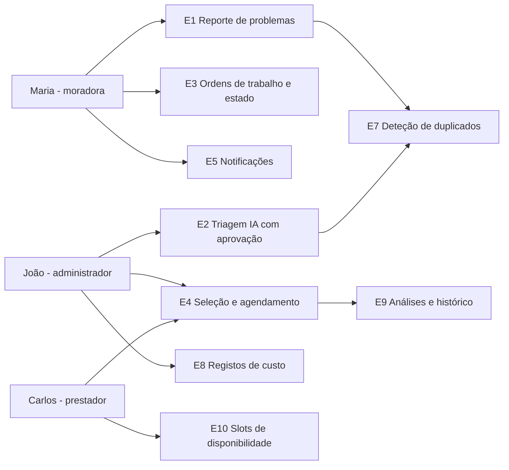

# Personas — Coordenador de Manutenção de Edifícios (CME)

> **Estado:** Concluído — pronto para entrega (personas a validar por entrevistas, conforme plano) · **Autoria:** Product Owner / Investigação de Utilizadores
> **Última atualização:** 2026-10-08
> **Satisfaz:** Enunciado oficial §5.3 e §5.4; componente "personas" do entregável 4 (Visão do Produto) da Sprint A
> **Método:** modelo de persona de Roman Pichler (nome, demografia, objetivos, frustrações, citação), alargado com contexto e implicações no backlog

As três personas abaixo foram derivadas do briefing mestre do projeto e **têm de ser confirmadas (ou corrigidas) por entrevistas reais** antes de serem tratadas como evidência. As citações são as do briefing e não declarações de pessoas reais.

---

## Persona 1 — Maria, 34 anos, moradora

| Campo | Conteúdo |
|---|---|
| **Demografia** | 34 anos; vive num edifício autogerido de 40 frações; trabalha a tempo inteiro; proprietária residente |
| **Objetivos** | Reportar um problema uma única vez a partir do telemóvel; saber quem vem e quando; não perder tempo a perseguir o estado do pedido |
| **Frustrações** | Pedidos perdidos nos grupos de WhatsApp; ausência de confirmação de receção; informação contraditória; tirar tempo do trabalho para um prestador que não aparece |
| **Citação** | *"Só quero saber quem é que vem e quando."* |
| **Contexto / comportamento** | Usa WhatsApp diariamente; tira fotografias por hábito; reporta problemas entre o trabalho e a vida pessoal; também reporta problemas de zonas comuns (elevador, porta da garagem, infiltrações) |
| **Implicações no backlog** | E1 — reporte com fotografia e fração, campos mínimos; E3 — cronologia de estado visível para quem reportou; E5 — notificação com data prevista; E7 — a deteção de duplicados não pode silenciar o seu relato sem a informar |

## Persona 2 — João, 58 anos, administrador voluntário

| Campo | Conteúdo |
|---|---|
| **Demografia** | 58 anos; administrador eleito do condomínio, voluntário não remunerado; coordena prestadores a par do seu emprego |
| **Objetivos** | Manter o edifício a funcionar sem consumir as suas noites; preparar e justificar custos na assembleia anual de proprietários |
| **Frustrações** | Coordenação por telefone; ausência de registo estruturado; escolher prestadores de memória; proprietários a questionar despesas sem evidência |
| **Citação** | *"Eu aprovo o dinheiro. Quero que a IA prepare a decisão, não que a tome."* |
| **Contexto / comportamento** | Decisor da despesa; guarda notas em folha de cálculo ou no histórico do WhatsApp; confia num pequeno círculo de prestadores; avesso a erros públicos |
| **Implicações no backlog** | E2 — sugestão de triagem sempre anexada ao relato e seguida de aprovação explícita; E4 — opções de prestador ordenadas por preço/localização/disponibilidade; E8 — registo de custos por intervenção; E9 — análises por tipo de problema e zona |

## Persona 3 — Carlos, 42 anos, prestador (canalizador)

| Campo | Conteúdo |
|---|---|
| **Demografia** | 42 anos; canalizador independente ao serviço de vários edifícios da zona; equipa pequena; trabalha a partir da carrinha e do telemóvel |
| **Objetivos** | Trabalho local estável com contexto completo antes de chegar; menos visitas desperdiçadas e menos chamadas |
| **Frustrações** | Pedidos vagos ("o lava-loiça está a verter algures"), sem número de fração nem fotografia; conflitos de agenda; faltas a visitas marcadas (no-shows) |
| **Citação** | *"Mande-me a fotografia e a fração, e fico contente."* |
| **Contexto / comportamento** | Não é membro da comunidade; não vai adotar uma aplicação pesada; responde ao telefone; valoriza âmbito de trabalho claro e vista de calendário |
| **Implicações no backlog** | E4 — detalhe do trabalho com fotografia e fração; E10 — slots de disponibilidade com esforço mínimo; E5 — notificação de reserva confirmada; o ranking não pode expor dados pessoais dos moradores além do necessário ao trabalho |

## Mapa persona → épico

## Estado de validação

| Aspeto | Estado |
|---|---|
| Entrevistas realizadas | **Nenhuma** (data de referência: 2026-10-08) |
| Inquérito | **Não lançado** |
| Testes de protótipo | **Não realizados** |
| Plano de validação | Definido (5–6 moradores, 2–3 administradores, 2–3 prestadores; inquérito ≥30 respostas) |
| Tratamento de dados | Sem dados pessoais recolhidos; amostragem por conveniência via rede da equipa, documentada como limitação |

*(Em caso de divergência entre a persona e os resultados das entrevistas, prevalecem os resultados; a persona é revista ou eliminada com registo do motivo.)*

## Limitações

- Todos os atributos demográficos, comportamentos e prioridades são **pressupostos**; nenhuma entrevista os confirmou.
- A amostra futura será por conveniência (edifícios da equipa), não representativa.
- A pessoa que compra (comprador económico) é a administração voluntária — um perfil sem orçamento formal, o que pode afetar a disposição a pagar.
- As citações são provenientes do enunciado/briefing, não de participantes reais.

## Percurso de engenharia (Análise → Desenho → Revisão)

| Fase | Atividade / evidência | Estado |
|---|---|---|
| Análise | Extração das três personas e citações do briefing mestre; nenhum dado de entrevista existe | Concluída |
| Desenho | Fichas Pichler com implicações no backlog e mapa persona→épico | Concluída |
| Revisão | Revisão do investidor na Sprint A; revisão por entrevistas antes da Sprint B | **Pendente** |

## Questões abertas para o investidor/cliente

1. O administrador voluntário é o comprador económico correto, ou deve ser acrescentada uma persona de gestor profissional?
2. Três personas bastam para a Sprint A, ou espera-se uma quarta persona "proprietário não residente / arrendatário"?
3. As citações devem ser reescritas após as entrevistas, mesmo que a citação original continue representativa?
4. Que nível de detalhe demográfico é esperado por persona, face ao detalhe comportamental?
