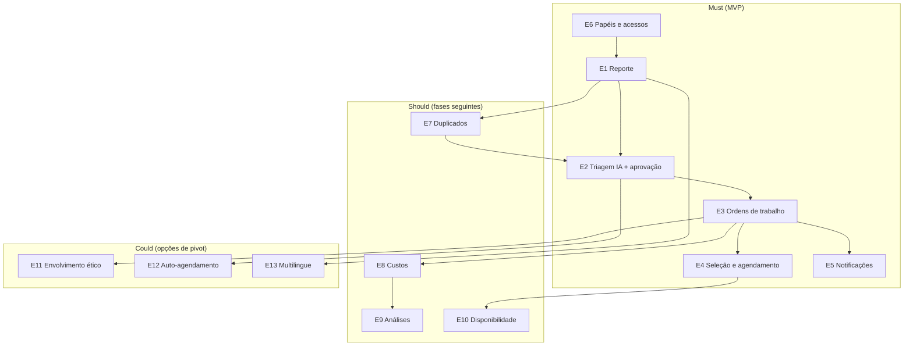

# Funcionalidades Principais — Coordenador de Manutenção de Edifícios (CME)

> **Estado:** Concluído — pronto para entrega (prioridades propostas para acordo com o investidor) · **Autoria:** Product Owner / Analista de Negócio
> **Última atualização:** 2026-10-08
> **Satisfaz:** Enunciado oficial §5.4, §5.6 e §7.1.2 (entregável 5 — backlog priorizado); Sprint A, entregável 8 (Épicos)
> **Método:** épicos com priorização MoSCoW, fatiamento INVEST, fatores de prioridade da cadeira (valor; conhecimento/incerteza/risco; capacidade de entrega; dependências)

---

## 1. Como as funcionalidades resolvem o problema

O produto implementa um ciclo único — **reportar → triar (IA) → aprovar (humano) → selecionar/agendar → notificar → resolver → registar** — e cada funcionalidade principal ataca diretamente uma das hipóteses de problema da visão (`01-visao-produto.md`, §2):

| Funcionalidade | Hipótese que ataca | Como resolve |
|---|---|---|
| E1 Reporte de problemas | H1 | Um único canal estruturado (descrição + fração + fotografia) substitui o WhatsApp; o morador recebe confirmação de receção |
| E2 Triagem por IA com aprovação humana | H2 | A IA sugere tipo, severidade e informação de intervenção; a administração revê uma decisão preparada em vez de classificar de raiz |
| E3 Ordens de trabalho e acompanhamento | H1, H2 | Ciclo de estados explícito (Recebido → … → Resolvido) com cronologia auditável; nada se perde |
| E4 Seleção e agendamento de prestador | H2, H3 | Opções ordenadas por preço, localização, disponibilidade e tipo de serviço; reserva na agenda com o contexto completo do trabalho |
| E5 Notificações | H1, H3 | Avisos de mudança de estado para morador, administração e prestador, com data prevista quando exista |
| E6 Papéis e acessos | Governação | Visibilidade e ações limitadas por papel; registo de auditoria de todas as ações com consequências (autenticação simulada no MVP — ADR-005) |
| E7 Deteção de duplicados | H2 | Agrupa relatos semelhantes do mesmo problema para não tratar duas vezes a mesma avaria |
| E8 Registos de custo | H4 | Registo do custo na resolução, alimentando o histórico do edifício |
| E9 Análises e histórico | H4 | Painel com tipos de problema mais frequentes, zonas críticas, envelhecimento e tendência de custos; narrativas geradas por IA sobre dados verificados |
| E10 Slots de disponibilidade | H3 | Os prestadores publicam e mantêm janelas agendáveis com esforço mínimo |
| E11 Envolvimento ético | Comunidade | Objetivo comunitário agregado ("reduzir relatos abertos há mais de 7 dias a zero") e reconhecimento de contribuições verificadas, com *opt-out* |
| E12 Auto-agendamento (baixa severidade) | H2 | Candidato explícito a revisão por feedback do investidor; conflitua com a regra dos 100% de aprovação humana e só avança se for limitado e aceite |
| E13 Multilingue PT/EN | H1 | Relatos e notificações em português e inglês; adiado |

## 2. Catálogo de épicos e prioridade MoSCoW

| ID | Épico | Descrição | MoSCoW | Persona | Preocupação INVEST / fatiamento |
|---|---|---|---|---|---|
| E1 | Reporte de problemas | Relatar problema com descrição + fotografia opcional; guardado como "Recebido" | **Must** | Maria | Fotografias/validação aumentam o tamanho; separar esqueleto do formulário completo |
| E2 | Triagem por IA + aprovação humana | Classificação assíncrona (tipo, severidade, intervenção); administração aceita/edita/rejeita; *fallback* de regras | **Must** | João | Incerteza elevada (qualidade/latência do LLM); separar sugestão de aprovação |
| E3 | Ordens de trabalho e acompanhamento | Ciclo Recebido → … → Arquivado, incluindo rejeição/agrupamento; cronologia para o morador | **Must** | Maria, João | Muitas transições; fatiar por grupo de transições após acordo no state machine |
| E4 | Seleção e agendamento | Ordenar prestadores (preço, localização, disponibilidade, serviço) e agendar intervenção | **Must** | João, Carlos | Depende do simulador de calendário; separar ranking (lógica) de reserva (integração) |
| E5 | Notificações | Notificações de mudança de estado; estado de entrega; retentativas | **Must** | Maria, Carlos | Fornecedor simulado; fatiar por tipo de evento; envios idempotentes |
| E6 | Papéis e acessos | Visibilidade/ações por papel; auditoria de ações com consequências; autenticação simulada (ADR-005) | **Must** | João | O mock pode esconder lacunas; manter testes de autorização reais; fatiar por papel |
| E7 | Deteção de duplicados | Agrupar relatos semelhantes/duplicados; precisão ≥80% | Should | João | Depende da similaridade de E2; separar deteção de fusão |
| E8 | Registos de custo | Registar custo final na resolução; alimenta histórico/análises | Should | João | Pequeno, baixo risco; depende de E3 |
| E9 | Painel de análises | Histórico + gráficos/narrativas IA sobre problemas e custos | Should | João | Grande; fatiar por gráfico; depende dos dados de E3/E8 |
| E10 | Slots de disponibilidade | Prestadores publicam/mantêm janelas agendáveis | Should | Carlos | Depende de E4; simulador primeiro |
| E11 | Envolvimento ético | Objetivo do edifício + reconhecimento de contribuições verificadas, *opt-out*, controlos de abuso | Could | Maria | Risco de gamificação; exige as cinco explicações obrigatórias do enunciado |
| E12 | Auto-agendamento baixa severidade | Agenda trabalhos de baixa severidade sem aprovação prévia | Could | João | Candidato a revisão por feedback; conflitua com 100% de aprovação humana |
| E13 | Multilingue PT/EN | Relatos/notificações em PT e EN | Could | Maria | Intensivo em conteúdo; fatiar por superfície; adiar |

**Não faremos (agora):** pagamentos/rendas, leilões de mercado entre prestadores, sensores IoT, portefólios multi-edifício.

## 3. Relações de dependência entre épicos

## 4. Funcionalidades dentro vs. fora do MVP

| Funcionalidade | MVP (Sprint B/C) | Fora do MVP (versão) |
|---|:---:|---|
| E1 Reporte com descrição/fração/fotografia | ✅ | — |
| E2 Triagem por IA com aprovação + *fallback* | ✅ | — |
| E3 Ordens de trabalho (ciclo de estados) | ✅ | — |
| E5 Notificações (simulador aceitável) | ✅ | — |
| E6 Papéis com autenticação simulada | ✅ | — |
| E4 Seleção/agendamento automáticos | Passo fino: seleção manual e confirmação por *link* | E4 completo na v1.1 |
| E7 Duplicados | Sugestão básica | Refinamento na v1.2 |
| E8 Custos | Campo opcional na resolução | Livro de custos completo na v1.2 |
| E9 Análises | — (só se capturam os dados) | v1.2 |
| E10 Disponibilidade | — | v1.1 |
| E11 Envolvimento ético | Desenhado, não implementado | Depois do MVP |
| E12 Auto-agendamento | — | Pivot potencial pós-feedback |
| E13 Multilingue | — | v1.2 |

O MVP é considerado o **menor experimento credível** porque cada item incluído serve uma de três provas: (a) o ciclo do morador fecha ponta-a-ponta; (b) o fluxo de IA com humano no circuito é fiável; (c) o sistema é implantável e observável. Segue o princípio do *walking skeleton* e a priorização por risco (as incertezas maiores — confiança na IA e integração externa — vêm primeiro).

## 5. Envolvimento ético e IA responsável (requisitos transversais do enunciado)

- **Mecanismo de envolvimento ético (E11):** objetivo comunitário agregado por edifício + reconhecimento de contribuições verificadas, privado por omissão, com *opt-out*; sem pontos, medalhas ou rankings individuais por omissão (evita incentivar volume em vez de resolução e exposição de problemas domésticos). As cinco explicações obrigatórias (comportamento incentivado, benefício, prevenção de abuso, riscos de exclusão/exposição, controlo/opt-out) estão documentadas na versão original do projeto.
- **IA responsável (transversal a E2/E7/E9):** pelo menos um fluxo assistido por IA com necessidade demonstrada — classificação/encaminhamento, extração estruturada e deteção de semelhanças; a IA **sugere**, nunca decide; resultados rotulados "sugestão de IA" com confiança; *baseline* e *fallback* não-IA por classificador de regras; nenhuma ação com consequências (reserva, despesa) sem aprovação humana; sugestões são imutáveis e as correções humanas auditadas.

## 6. Limitações

- As prioridades MoSCoW são a **proposta da equipa**; aguardam acordo do investidor na revisão da Sprint A.
- As personas que fundamentam as funcionalidades não estão validadas; os IDs de histórias *Should/Could* são marcadores de posição.
- Não há estimativas nesta versão: apenas quem constrói estima (Planning Poker, escala Fibonacci), segundo os slides da cadeira.

## 7. Percurso de engenharia (Análise → Desenho → Revisão)

| Fase | Atividade / evidência | Estado |
|---|---|---|
| Análise | Extração dos épicos do briefing mestre e do enunciado; aplicação dos fatores de prioridade da cadeira | Concluída |
| Desenho | Catálogo, diagrama de relações, fronteira do MVP, implicações INVEST e mecanismos transversais | Concluída |
| Revisão | Revisão do investidor na Sprint A | **Pendente** |

## 8. Questões abertas para o investidor/cliente

1. E1–E6 é o MVP mínimo credível, ou algum épico *Must* pode ser adiado sem quebrar o ciclo?
2. Para E12, que limite de severidade/valor tornaria o auto-agendamento aceitável face à regra dos 100%?
3. E10 deve substituir o simulador de calendário como integração principal na Sprint B/C?
4. A precisão de duplicados deve medir-se por relato agrupado ou por par candidato (E7)?
5. Que pergunta única deve o painel de análises (E9) responder na assembleia anual para ser valioso?
