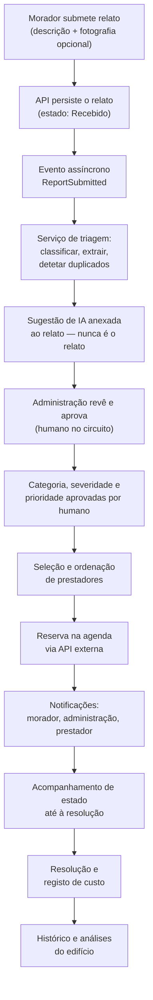
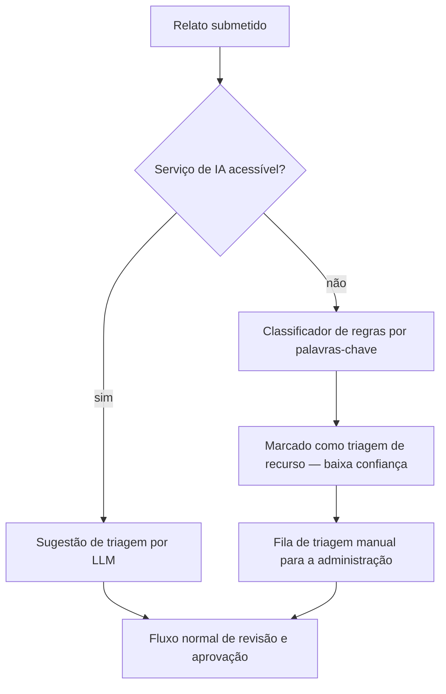
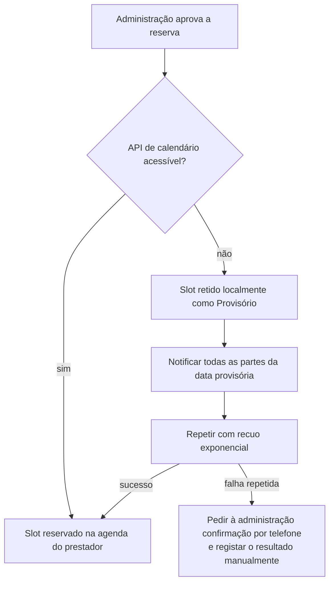
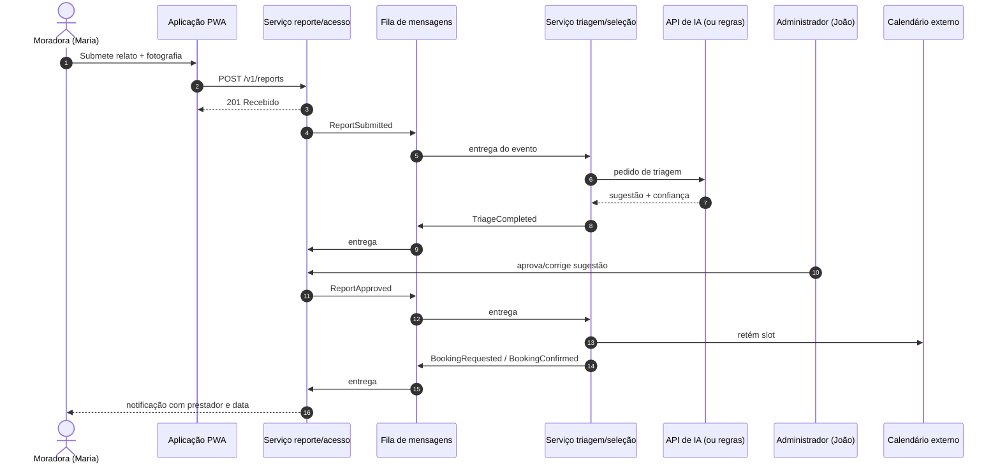

# Workflows Principais dos Utilizadores — Coordenador de Manutenção de Edifícios (CME)

> **Estado:** Concluído — pronto para entrega (desenhos-hipótese, a validar com utilizadores) · **Autoria:** Analista de Negócio / Product Owner
> **Última atualização:** 2026-10-08
> **Satisfaz:** Enunciado oficial §5.4 (jornadas principais) e §6.8 (operação degradada); componente "jornadas" do entregável 4 da Sprint A
> **Nota de rigor:** os fluxos abaixo descrevem a experiência **pretendida**. Nenhum utilizador testou estes percursos; os tempos-alvo ("minutos", "<24 h") são hipóteses por provar.

---

## 1. Workflow principal ponta-a-ponta

O ciclo central do produto, do relato do morador até à memória do edifício:

**Regras estruturais do fluxo:**

1. A sugestão da IA é **aditiva e imutável**: fica anexada ao relato como sugestão; os valores autoritativos são os aprovados pelo humano.
2. Toda a triagem corre **de forma assíncrona** (o morador recebe confirmação imediata de receção; a triagem chega depois, com estado pendente visível).
3. Ações com consequências — agendamento e despesa — exigem **aprovação humana a 100%**.
4. O estado da ordem de trabalho só avança (nunca recua); transições inválidas são rejeitadas, tentadas de novo e, em último caso, encaminhadas para uma fila de mensagens mortas.

## 2. Jornada de Maria (moradora)

Maria repara numa mancha de água debaixo do lava-loiça na terça-feira à noite. Abre a PWA, toca em "Reportar problema", seleciona a fração e o tipo (ou deixa o tipo para a IA), acrescenta uma fotografia e uma frase. A aplicação confirma "Recebido" e mostra o pedido na sua lista. Quando a triagem termina, a sua vista mostra "Em revisão pela administração", **sem expor a sugestão da IA como facto**. Quando João aprova e a reserva é bem-sucedida, recebe uma notificação com o nome do prestador e a janela da visita. Se a data mudar, é notificada; após a reparação, confirma a resolução e pode consultar o custo da intervenção. A prática atual (WhatsApp) não oferece nenhum destes passos — esta jornada é uma **hipótese de desenho**.

## 3. Jornada de João (administrador)

João abre uma **fila de triagem** em vez do histórico de chamadas. Cada novo relato mostra a descrição, a fotografia, a sugestão da IA (tipo de problema, severidade provável, detalhes extraídos) claramente rotulada como sugestão, e eventuais duplicados agrupados para tratamento conjunto. João edita ou aceita a categoria e a severidade — **os únicos valores autoritativos**. Revê opções de prestador ordenadas (tipo de serviço, localização, disponibilidade, indicação de preço) e aprova uma reserva; a integração de calendário coloca o slot e saem as notificações. No fim do mês abre a vista de análises para ver relatos abertos, itens envelhecidos, tipos de problema, zonas críticas e histórico de despesa para a assembleia de proprietários. **Nunca gasta dinheiro através da plataforma sem aprovar.**

## 4. Jornada de Carlos (prestador)

Carlos recebe uma notificação (inicialmente por email/SMS com um *link*, sem necessidade de conta) com fotografia, fração, descrição do problema e janela de visita pretendida. Confirma ou propõe outro horário; o sistema regista a reserva e relembra-o no dia anterior. Após a visita marca o trabalho como concluído e acrescenta uma nota curta e o custo. O contexto completo antes de chegar é o valor central para ele.

## 5. Fluxo degradado A — serviço de IA indisponível

O workflow principal **continua**: a administração tria manualmente com pistas de regras. A interface rotula o resultado como "sugestão por regras, IA indisponível" e **nunca apresenta saída incerta como facto verificado** (enunciado §5.6.2). Relatos submetidos durante a indisponibilidade podem ser reprocessados mais tarde se a plataforma os puder enriquecer sem sobrepor decisões humanas.

## 6. Fluxo degradado B — calendário externo indisponível

A reserva **nunca se perde silenciosamente**: o estado provisório é visível para o morador e não há duplo agendamento, porque a retenção local é autoritativa até ser sincronizada.

## 7. Sequência de eventos (visão técnica resumida)

Garantias de fiabilidade documentadas no desenho: **deduplicação por identificador de evento**, **retentativas com recuo exponencial**, **fila de mensagens mortas com replay seguro**, **idempotência** nas escritas e **consistência eventual** com estados pendentes visíveis na interface.

## 8. Limitações

- Todas as jornadas são desenhos-hipótese; **nenhum utilizador testou qualquer percurso**.
- Os alvos de tempo (<24 h, "minutos") não estão provados; não existe linha de base medida da prática atual.
- O canal de notificação dos prestadores (email vs. SMS vs. WhatsApp) está por decidir e depende das entrevistas.
- O comportamento quando um relato é agrupado com outro (o que a moradora vê) ainda não está decidido.
- O fluxo degradado foi desenhado, mas **ainda não implementado nem demonstrado** (pertence à Sprint B/C).

## 9. Percurso de engenharia (Análise → Desenho → Revisão)

| Fase | Atividade / evidência | Estado |
|---|---|---|
| Análise | Expansão do fluxo de referência por persona; identificação dos caminhos degradados a partir do enunciado §6.8 | Concluída |
| Desenho | Narrativas por persona, fluxograma principal, fluxos degradados (IA/calendário), sequência de eventos resumida | Concluída |
| Revisão | Revisão do investidor na Sprint A; validação com utilizadores antes da Sprint B | **Pendente** |

## 10. Questões abertas para o investidor/cliente

1. Quando a deteção de duplicados agrupa um relato novo com um existente, a moradora deve ser informada explicitamente? O que deve a sua vista de estado mostrar?
2. A reserva provisória local é aceitável para o investidor como modo degradado do calendário, ou prefere uma falha explícita com retentativa?
3. Os prestadores devem ter de criar conta no MVP, ou basta a confirmação por *link*?
4. Para problemas de baixa severidade, algum percurso pode reduzir o passo de aprovação humana, ou a regra dos 100% mantém-se universal?
