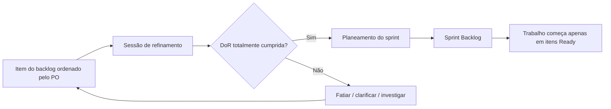

# Definition of Ready (DoR) — Coordenador de Manutenção de Edifícios (CME)

> **Estado:** Concluído — pronto para entrega · **Autoria:** Scrum Master (checklist escrita pela equipa, para a equipa)
> **Última atualização:** 2026-10-08
> **Satisfaz:** Enunciado oficial §8.2 e slides de Product Management (Módulo 5 — DoR); Sprint A, entregável 11 (metodologia: DoR/DoD)

---

## 1. Objetivo

A DoR responde à pergunta da equipa: **«Já podemos começar a trabalhar nisto?»**. É uma checklist escrita pela equipa, para a equipa, que todos os itens do backlog têm de satisfazer antes de entrarem num sprint. A sua finalidade é impedir que histórias encravem a meio do sprint — protegendo a velocidade e a moral — e emparelhar com a Definition of Done para delimitar o processo de entrega (slides da cadeira, Módulo 5).

## 2. Como se usa

1. O Product Owner leva os itens candidatos, pela ordem do backlog, a uma sessão de refinamento **pelo menos dois dias úteis antes do planeamento do sprint**.
2. Os Developers percorrem a checklist ponto por ponto e marcam cada critério como cumprido, não cumprido ou não aplicável (com justificação). O item está *Ready* apenas quando **todos os critérios aplicáveis estão cumpridos**; prontidão parcial não é prontidão.
3. O Product Owner responde na hora às questões de negócio; regras de negócio por resolver bloqueiam a prontidão.
4. A evidência é registada no ticket (esboço ligado, casos de teste, lista de dependências, estimativa). «Acordo verbal na reunião» não é evidência.
5. Durante o planeamento do sprint, apenas itens *Ready* podem entrar no Sprint Backlog. O Scrum Master verifica-o no planeamento, não depois.
6. Se uma regra em falta for descoberta a meio do sprint, os Developers levantam-na no Daily Scrum; o Product Owner decide renegociar âmbito, fatiar ou devolver o item ao backlog. A equipa nunca expande uma história em silêncio.

**Consequência do incumprimento:** o item não entra no sprint. Se tiver sido puxado por engano, é removido no planeamento e substituído pelo próximo item *Ready*. Falhas repetidas são um problema de refinamento, tratado na retrospetiva — nunca como culpa individual.

## 3. Checklist

| # | Critério | Como se reconhece «pronto» (evidência) | Responsável |
|---|---|---|---|
| 1 | Formato de história ligado a uma persona | «Como <persona>, quero… para que…», usando Maria, João ou Carlos (ou um papel *enabler* explicitamente nomeado para histórias técnicas) | Product Owner |
| 2 | Critérios de aceitação testáveis | 3–6 critérios Dado/Quando/Então que cobrem o caminho feliz e pelo menos um caso de falha/limite; sem adjetivos vagos | Product Owner + Developers |
| 3 | Verificação INVEST | A equipa registou qual a letra mais difícil; se não for *Small*, a decisão de fatiamento está escrita no ticket | Developers |
| 4 | Dependências identificadas | Tickets a montante/jusante, sistemas externos (API de LLM, simuladores de calendário/notificações, armazenamento de objetos) e restrições de ordem listados | Developers |
| 5 | UI esboçada | Esboço de baixa fidelidade ou *mock-up* anexado/ligado, incluindo estados vazios/erro/degradados relevantes para a história | Developers + Product Owner |
| 6 | Prioridade atribuída | Rótulo MoSCoW e posição no backlog acordados com o Product Owner; uma única pessoa responsável pela ordenação | Product Owner |
| 7 | Estimada pela equipa | Os Developers dimensionaram o item em pontos de história por Planning Poker; o PO e o Scrum Master não influenciaram o valor | Developers |
| 8 | Regras de negócio conhecidas | Transições de estado, validações, permissões por papel e mensagens de erro escritas (ex.: ciclo da ordem de trabalho, limiar de duplicados) | Analista de Negócio + Developers |
| 9 | Plano/casos de teste conhecidos | Tipos de teste (unitário/integração/ponta-a-ponta) e casos concretos delineados; abordagem de dados sintéticos declarada; itens de IA nomeiam casos de avaliação | QA + Developers |
| 10 | Notas não funcionais | IDs de requisitos não funcionais aplicáveis ligados (ex.: desempenho, resiliência, acessibilidade) | Developers |

## 4. Fluxo de prontidão

## 5. Notas e limitações

- Para *spikes* ou *enablers* explicitamente técnicos (por exemplo, o *walking skeleton*), os critérios 1, 5 e 8 são adaptados: a persona é o papel de developer/enabler, o «esboço de UI» é a definição da fatia e as regras de negócio estão intencionalmente ausentes por desenho.
- A DoR não garante que a história tem a prioridade certa; certifica apenas que **pode ser trabalhada**.
- A checklist é reavaliada na retrospetiva de cada sprint e atualizada quando a experiência mostrar critérios em falta ou redundantes.

## 6. Percurso de engenharia (Análise → Desenho → Revisão)

| Fase | Atividade / evidência | Estado |
|---|---|---|
| Análise | Extração dos requisitos da DoR a partir dos slides da cadeira (Módulo 5) e do enunciado §8.2 | Concluída |
| Desenho | Checklist com responsáveis, regras de evidência, fluxo de utilização e consequências | Concluída |
| Revisão | Revisão interna concluída; apresentação ao investidor integrada na primeira entrega | Concluída |

## 7. Questões abertas para o investidor/cliente

1. Deve a DoR exigir adicionalmente uma nota escrita de *rollout*/recuo para histórias que tocam serviços externos?
2. Quem, fora da equipa, pode desafiar a ordem do backlog — apenas o PO, segundo o 2020 Scrum Guide, ou os investidores podem acrescentar itens diretamente?
3. Um esboço de baixa fidelidade é evidência suficiente de prontidão de UI, ou espera-se um protótipo clicável antes do planeamento?
4. Deve o critério «plano de teste conhecido» exigir pelo menos um identificador de teste automatizado por critério de aceitação?
