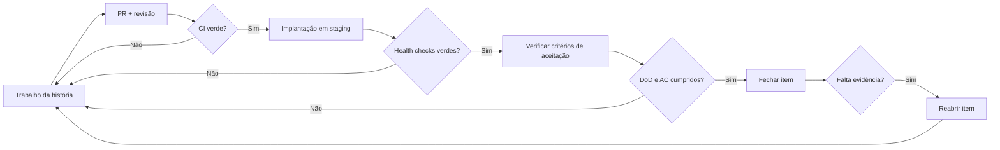

# Definition of Done (DoD) — Coordenador de Manutenção de Edifícios (CME)

> **Estado:** Concluído — pronto para entrega · **Autoria:** Scrum Master e QA
> **Última atualização:** 2026-10-08
> **Satisfaz:** Enunciado oficial §8.3–8.5 e slides de Product Management (Módulos 9–10 — DoD); Sprint A, entregável 11 (metodologia: DoR/DoD)

---

## 1. Objetivo

A DoD responde à pergunta da equipa: **«Já podemos fechar este item?»**. Todos os itens fechados têm de cumprir esta checklist. Um item que não cumpra **foi mal fechado e tem de ser reaberto** — aplica-se igualmente a código, documentos e funcionalidades com IA. A DoD não é negociável por história; as exceções são registadas como dívida técnica com ticket ligado e concordância do Product Owner.

## 2. Quando e quem

- O autor propõe o fecho; um revisor que não seja o autor verifica a checklist.
- A verificação acontece de forma contínua (CI + revisão por pares) e, finalmente, na revisão do sprint sobre o ambiente de *staging*.
- O Scrum Master verifica o cumprimento na revisão do sprint; os itens reabertos voltam ao Sprint Backlog ou ao Product Backlog.

## 3. Checklist

| # | Área | «Done» significa (evidência) |
|---|---|---|
| 1 | *Pull request* | PR ligado ao ticket, revisto e aprovado por ≥1 developer que não o autor; comentários resolvidos; ramo integrado após CI verde |
| 2 | Higiene de commits | Cada commit referencia o ticket (ex.: `CME-123`) com sintaxe de *smart commit* quando aplicável; nunca é integrado código quebrado em `main` |
| 3 | Testes unitários | Lógica nova/alterada coberta por testes unitários; suite passa localmente e no CI; cobertura respeita o alvo não funcional de manutenção |
| 4 | Testes de integração | Fronteiras de I/O tocadas pela alteração (BD, fila, armazenamento, simuladores) cobertas por testes de integração; a passar |
| 5 | Teste ponta-a-ponta | O percurso principal afetado pela história passa a suite E2E em *staging* |
| 6 | Pipeline CI | *Build*, testes, análise estática e verificações de dependências e segredos todos verdes; duração do pipeline dentro do alvo |
| 7 | Implantação | Imagem de contentor construída; implantada em *staging* pelo pipeline; `/health/live` e `/health/ready` saudáveis; caminho de reversão conhecido (etiqueta anterior da imagem) |
| 8 | Critérios de aceitação verificados | Cada critério Dado/Quando/Então do ticket demonstrado em *staging* e confirmado por alguém que não o autor; o Product Owner aceita |
| 9 | Observabilidade | *Logs* estruturados e pelo menos uma métrica adicionados para o novo comportamento; identificador de correlação/*trace* propagado; erros reportados com contexto |
| 10 | Documentação | Documentos afetados atualizados: contrato OpenAPI, notas ER/domínio, ADR se uma decisão mudou, README/runbook se a operação mudou; notas do ticket em dia |
| 11 | Rastreabilidade à DoR | Cada regra de negócio e critério de aceitação da DoR mapeia para um teste ou passo de verificação manual registado |
| 12 | Segurança e privacidade | Sem segredos no repositório ou nas imagens; testes de autorização nos *endpoints* tocados; entradas validadas; sem novos dados sensíveis sem nota de privacidade |
| 13 | Acessibilidade | A UI alterada passa a verificação automática (axe) e uma navegação apenas por teclado no fluxo afetado |
| 14 | Dados e migração | Qualquer alteração de esquema traz migração para a frente, reversível quando viável, exercitada sobre dados de *staging* |
| 15 | Funcionalidades com IA (adicional) | Caminho de *baseline*/*fallback* coberto por testes; cenário «LLM desligado» demonstrado; saída incerta rotulada «sugestão de IA»; casos adversariais adicionados ao conjunto de avaliação; portão de aprovação humana para ações com consequências verificado |

## 4. Fluxo de fecho

## 5. Notas e limitações

- Nem todas as linhas se aplicam a todos os itens (ex.: documentos não têm imagem de contentor); as linhas não aplicáveis são marcadas com uma justificação de uma linha no ticket, nunca ignoradas em silêncio.
- Os alvos de cobertura e latência serão re-baselinados após a evidência da Sprint B.
- A linha 15 (IA) existe porque a avaliação honesta do caminho com IA exige que o caminho sem IA seja exercitado; sem isso, a afirmação de «done» sobrestimaria a capacidade.

## 6. Percurso de engenharia (Análise → Desenho → Revisão)

| Fase | Atividade / evidência | Estado |
|---|---|---|
| Análise | Extração dos requisitos da DoD a partir dos slides da cadeira (Módulos 9–10) e do enunciado §8.3–8.5, §5.6.2–5.6.3 | Concluída |
| Desenho | Checklist numérica, fluxo de fecho, regra de reabertura e portão específico para IA | Concluída |
| Revisão | Revisão interna concluída; apresentação ao investidor integrada na primeira entrega | Concluída |

## 7. Questões abertas para o investidor/cliente

1. Um revisor por pares é suficiente, ou espera-se um segundo revisor para alterações à máquina de estados da ordem de trabalho ou à lógica de aprovação?
2. Deve a DoD exigir um vídeo de demonstração por história visível ao utilizador, além da verificação em *staging*?
3. Reabrir um item mal fechado dentro do mesmo sprint é obrigatório, ou pode transitar para o sprint seguinte com um ticket de dívida ligado?
4. Para histórias de IA, um teste ao *fallback* por regras mais uma demonstração «LLM desligado» são evidência suficiente, ou espera-se um relatório de avaliação completo por alteração de capacidade?
