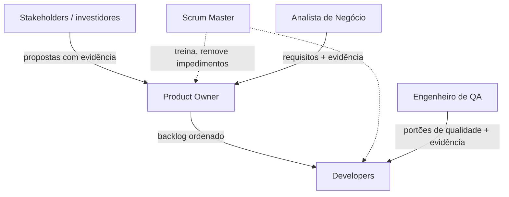
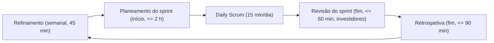

# Papéis da Equipa e Processo de Trabalho — Coordenador de Manutenção de Edifícios (CME)

> **Estado:** Concluído — pronto para entrega · **Autoria:** Scrum Master + Product Owner
> **Última atualização:** 2026-10-08
> **Satisfaz:** Sprint A, entregável 11 (pessoas e responsabilidades; metodologia, DoR, DoD); enunciado oficial §8.1–8.3 e slides de Product Management (Scrum 2020, estimação, acompanhamento, retrospetivas, *smart commits*, disciplina de processo)

---

## 1. Estrutura da equipa

A equipa é composta por 3 a 5 estudantes. Os papéis são funcionais, não hierárquicos, e podem acumular-se quando a dimensão da equipa o exigir — com uma exceção: o Product Owner e o Scrum Master não devem ser a mesma pessoa. Os docentes atuam como investidores/*stakeholders*, não como membros da equipa.

| Papel | Responsabilidades principais | Responsável por |
|---|---|---|
| **Product Owner (PO)** | Objetivo e visão do produto; ordenar o Product Backlog; definir e comunicar histórias; aceitar/rejeitar incrementos; ponto único de decisão de âmbito | Valor entregue; transparência do backlog |
| **Scrum Master (SM)** | Treinar a prática Scrum; facilitar eventos; remover impedimentos; proteger a equipa; acompanhar métricas de processo | Saúde do processo; eficácia das cerimónias |
| **Analista de Negócio (BA)** | Elicitação (entrevistas/inquéritos); requisitos e critérios de aceitação; investigação de mercado/concorrência; rastreabilidade; consistência documental | Qualidade dos requisitos; rastreabilidade da evidência |
| **Engenheiro de QA (QA)** | Estratégia e planos de teste; desenho de testes e evidência; portões de qualidade no CI; apoio à avaliação de IA; verificação da DoD | Cobertura e evidência de teste; sinal de qualidade da entrega |
| **Developer (Dev) × N** | Arquitetura e desenho; implementação; testes unitários/de integração; revisão de código; implantação e operações; observabilidade | Incremento funcional; qualidade técnica; capacidade de implantação |

**Regra de registo:** a atribuição nominal de cada papel é registada no arranque da Fase 1 no repositório (README) e na ferramenta de gestão (Jira ou equivalente), que constituem o registo autoritativo das responsabilidades. Se a equipa tiver menos de cinco elementos, o BA pode acumular com o PO apenas se a carga o permitir, e o QA com um Developer apenas com separação explícita de revisão — ninguém pode ser o único testador do seu próprio trabalho.

## 2. Regras de decisão

| Tipo de decisão | Quem decide | Mecanismo | Evidência |
|---|---|---|---|
| Prioridade e âmbito do backlog | PO (uma pessoa) | refinamento + revisão do sprint; contributos de todos | ordenação no Jira, registo do investidor |
| Conteúdo do sprint | Developers com o PO | planeamento do sprint, portão DoR | Sprint Backlog |
| Arquitetura / tecnologia | Developers (consenso), documentada pelo autor | ADR revisto em PR | ficheiros ADR |
| Portões de teste e qualidade | QA propõe, equipa concorda | checklist DoD no PR | resultados de CI, evidência de teste |
| Alterações de processo | Equipa | ações de melhoria da retrospetiva | notas da retrospetiva |
| Remoção urgente de impedimentos | SM | escalar e desbloquear | notas no quadro |

- O PO é responsável pelo **quê** e em **que ordem**; os Developers pelo **como**; o SM pelo **como a equipa trabalha**.
- Quem quiser alterar o backlog convence o PO — nunca o contorna (2020 Scrum Guide).
- Uma decisão sem responsável é inválida: cada ADR, ação e risco tem uma pessoa responsável.

## 3. Matriz RACI (versão leve)

R = responsável pela execução, A = responsável último (accountable), C = consultado, I = informado.

| Atividade | PO | SM | BA | QA | Devs |
|---|---|---|---|---|---|
| Investigação de domínio/utilizadores | C | I | R/A | C | C |
| Priorização do backlog e MoSCoW | A/R | C | C | C | C |
| Visão do produto e personas | A | I | R | I | C |
| Arquitetura e ADRs | C | I | C | C | A/R |
| Implementação e revisão de código | I | I | C | C | A/R |
| Estratégia e execução de testes | C | I | C | A/R | R |
| Avaliação de segurança e privacidade | C | I | C | R | A |
| Implantação e operações | I | I | I | C | A/R |
| Pipeline CI/CD | I | I | I | R | A/R |
| Preparação da revisão do investidor | A/R | R | R | C | C |
| Retrospetivas de sprint | C | A/R | R | R | R |

## 4. Processo de trabalho: Scrum em prática

O quadro é o Scrum do 2020 Scrum Guide, adaptado a um projeto de cadeira com três sprints; as revisões com os investidores substituem algumas interações com *stakeholders*. A duração do sprint segue o calendário da cadeira (3–4 semanas); os *timeboxes* escalam proporcionalmente.

### 4.1 Eventos e cadência

| Evento | Quando | *Timebox* alvo | Resultado |
|---|---|---|---|
| Refinamento do backlog | semanal | 45 min | histórias cumprem a DoR; estimativas atualizadas |
| Planeamento do sprint | primeiro dia | ≤ 2 h | Objetivo do Sprint; Sprint Backlog (tarefas em horas) |
| Daily Scrum | todos os dias úteis | 15 min | plano para 24 h; bloqueios sinalizados |
| Revisão do sprint | último dia | ≤ 60 min | feedback capturado; backlog adaptado |
| Retrospetiva | último dia | ≤ 90 min | 1–2 ações de melhoria com responsáveis |
| Sessão de desenho/ADR pontual | conforme necessário | ≤ 45 min | decisões de arquitetura registadas |

As revisões respondem à pergunta do investidor de cada sprint; as retrospetivas usam *Start/Stop/Continue*, perguntando sempre: «Como podemos trabalhar ainda melhor no próximo sprint?».

### 4.2 Artefactos

- **Product Backlog** (Jira): épicos E1–E13, priorizados por MoSCoW, verificados com INVEST, ordenados por valor, risco/incerteza, capacidade de entrega e dependências, dimensionados em pontos Fibonacci.
- **Sprint Backlog**: histórias selecionadas fatiadas em tarefas estimadas em **horas**, com responsáveis.
- **Incremento**: trabalho que cumpre a DoD e está implantado em *staging* — não trabalho meramente anunciado.

### 4.3 Política de estimação

- Itens do backlog: escala tipo Fibonacci (1, 2, 3, 5, 8, 13, 21) por **Planning Poker**; dimensionamento relativo, nunca horas para compromissos (os pontos são locais da equipa, não comparáveis entre equipas).
- Tarefas do sprint: finas, habitualmente em horas.
- **Só quem constrói o Incremento estima.** O PO e o Scrum Master não estimam nem influenciam estimativas; podem clarificar requisitos e critérios de aceitação.
- Re-estimação apenas com informação nova; *spikes* são estimados como qualquer item pelos Developers. A saúde da estimação é revista nas retrospetivas (desvios repetidos significam fatiamento errado, não inflação de pontos).

### 4.4 Acompanhamento do progresso

- **Burndown do sprint**: horas/pontos remanescentes por dia face à linha ideal, visível no Jira.
- **Quadro Kanban**: A Fazer / Em Curso / Em Revisão / Bloqueado / Concluído, com limites WIP (alvo: máx. 2 itens em curso por Developer) e razões de bloqueio explícitas.
- As métricas evidenciam progresso e revelam risco cedo; a velocidade é um intervalo de planeamento, nunca uma meta.

### 4.5 Ligação DoR/DoD

- Um item entra num sprint **apenas se cumprir a DoR** (`06-definition-of-ready.md`): história ligada a persona, critérios de aceitação testáveis, INVEST, dependências resolvidas, UI esboçada, prioridade atribuída, estimada pela equipa.
- Um item fecha **apenas se cumprir a DoD** (`07-definition-of-done.md`): PR revisto, testes a passar, CI verde, implantado em *staging* com *health checks*, critérios de aceitação verificados, *logs*/métricas no lugar, documentação atualizada, commit ligado ao ticket, sem segredos. Itens mal fechados são reabertos; o PO decide com base em evidência, não em otimismo.

## 5. Git e *smart commits*

- *Trunk-based*: `main` sempre implantável; ramos curtos `feat|fix|chore/CME-<id>-slug`.
- Cada commit referencia um ticket: `CME-42: validar mapeamento de severidade`; comandos de *smart commit* (`CME-42 #comment ... #time 2h`) dão rastreabilidade e automação de fluxo.
- Puxar/commitar/publicar com frequência; nunca commitar código quebrado; testar sempre antes de publicar. Os PR exigem revisão e pipeline verde antes da integração.

## 6. Disciplina de processo de engenharia

Todos os entregáveis — código ou documento — seguem **Análise → Desenho → Plano de teste → Código → Execução de teste** com evidência: os documentos carregam o seu percurso; os itens de código declaram análise e desenho no ticket/ADR, definem o plano de teste, são implementados via PR e fornecem evidência de execução (execução de CI, capturas, resultados de avaliação) antes de o PO os aceitar.

## 7. Ferramentas

| Finalidade | Ferramenta | Notas |
|---|---|---|
| Controlo de versões, PR, CI/CD | GitHub + Actions | proteção de ramo em `main` |
| Backlog, sprints, quadros, decisões | Jira ou equivalente | um projeto, tickets `CME-<id>` |
| Contentores, *staging* | Docker Compose | ver vista de implantação |
| Divulgação do uso de IA | registo de uso de IA | por entregável, incluindo como a saída foi desafiada |

Sem segredos no repositório; os controlos de segurança nunca são desativados para demonstrações. Itens bloqueados são levantados no Daily Scrum; questões abertas ficam registadas até serem respondidas.

## 8. Evidência de contribuição individual (enunciado §10)

PRs de autoria/coautoria, revisões de código, testes, ADRs, atividades de investigação, refinamento do backlog, trabalho de implantação, melhorias operacionais, documentação, participação em revisões de sprint e reflexões individuais. A contagem bruta de commits **não** é aceite como evidência de contribuição (enunciado §8.1); avalia-se a qualidade e o impacto.

## 9. Limitações

- A duração do sprint e os *timeboxes* seguem o calendário da cadeira; serão ajustados se o calendário oficial o exigir.
- Os limites WIP e os intervalos de velocidade não têm histórico; os primeiros números serão imprecisos e serão re-baselinados após a Sprint B.
- A escolha final da ferramenta de gestão (Jira ou equivalente) é registada no arranque; os modelos de trabalho podem precisar de ajuste após essa escolha.

## 10. Percurso de engenharia (Análise → Desenho → Revisão)

| Fase | Atividade / evidência | Estado |
|---|---|---|
| Análise | Revisão do 2020 Scrum Guide, dos slides da cadeira (estimação, acompanhamento, *smart commits*) e do enunciado §8 | Concluída |
| Desenho | Papéis, responsabilidades, regras de decisão, RACI, eventos, artefactos, estimação, acompanhamento, Git e ferramentas | Concluída |
| Revisão | Revisão interna concluída; apresentação ao investidor integrada na primeira entrega | Concluída |

## 11. Questões abertas para o investidor/cliente

1. As 3–4 semanas por sprint estão corretas, ou as Sprints A/B/C devem ter durações diferentes?
2. A demonstração da revisão do sprint deve correr sempre em *staging*, ou apenas quando existe uma fatia vertical?
3. O Jira é obrigatório, ou um equivalente como o GitHub Projects é aceitável?
4. Que evidência de contribuição individual tem maior peso na avaliação final?
