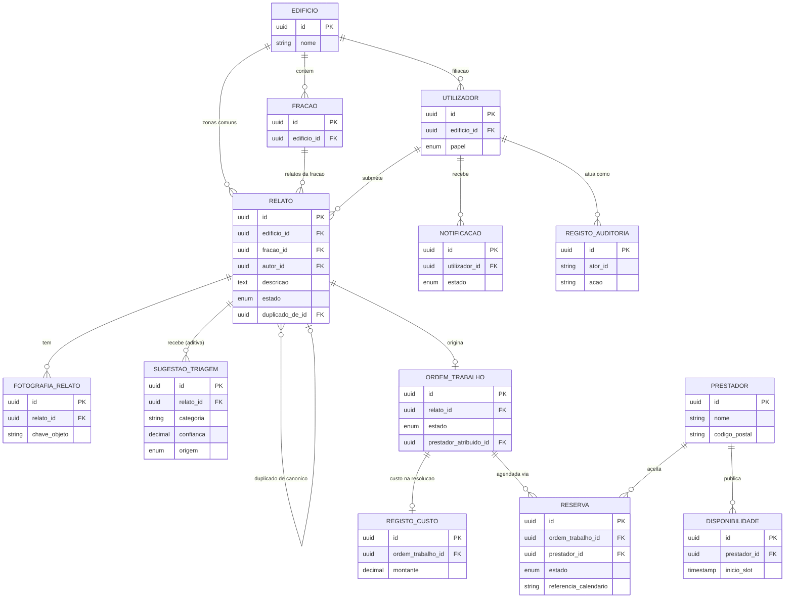

# Modelo de Domínio — Coordenador de Manutenção de Edifícios (CME)

> **Estado:** Concluído — pronto para entrega · **Autoria:** Arquiteto de Software
> **Última atualização:** 2026-10-08
> **Satisfaz:** Enunciado oficial §6.4 (gestão de dados); Sprint A, entregável 7 (Desenho Técnico — Modelo de Dados)
> **Decisão de armazenamento:** PostgreSQL único com dois esquemas (`ras` e `tms`) — ver vista de contentores em `10-arquitetura-alto-nivel.md`; eventos descritos no fluxo assíncrono da mesma vista.

---

## 1. Diagrama entidade-relação

## 2. Entidades e propriedade

| Entidade | Serviço proprietário | Descrição |
|---|---|---|
| Edifício | reporte/acesso | Condomínio; inquilino de todos os dados |
| Fração | reporte/acesso | Apartamento ou referência de zona comum |
| Utilizador | reporte/acesso | Morador, administrador ou prestador; um papel |
| Relato | reporte/acesso | Submissão; a categoria/severidade aprovadas vivem aqui |
| FotografiaRelato | reporte/acesso, MinIO (bytes) | Evidência fotográfica imutável |
| SugestãoTriagem | triagem/seleção | Sugestão imutável de IA/regras por relato |
| OrdemTrabalho | reporte/acesso | Intervenção aprovada a partir de um relato |
| Prestador | triagem/seleção | Perfil de diretório usado na ordenação |
| Disponibilidade | triagem/seleção | Slots com proveniência de sincronização |
| Reserva | triagem/seleção | Slot pedido/confirmado |
| RegistoCusto | reporte/acesso | Montante registado na resolução |
| Notificação | reporte/acesso | Registo na aplicação; estado do fornecedor refletido |
| RegistoAuditoria | reporte/acesso (o serviço de triagem emite eventos de auditoria) | Quem fez o quê, quando |

**Regra de propriedade:** uma única instância de base de dados, dois esquemas, sem consultas entre esquemas; a integração entre serviços faz-se apenas por REST ou eventos, imposição por permissões de esquema e testes de contrato no CI.

## 3. Invariantes de negócio

1. **A IA é consultiva e imutável:** as sugestões são aditivas; as correções são novas decisões humanas escritas nos campos aprovados do relato, acompanhadas de um registo de auditoria.
2. **Ciclo de vida apenas para a frente:** o estado nunca recua; uma transição que não corresponda ao estado esperado é rejeitada, repetida e, em último caso, encaminhada para a fila de mensagens mortas. `Fundido`/`Arquivado` são terminais.
3. **Custo apenas na resolução:** um registo de custo é criado na transição para `Resolvido`; correções posteriores são novos registos de ajuste, nunca edições.
4. **Uma reserva ativa por ordem de trabalho:** índice único parcial em `RESERVA(ordem_trabalho_id)` para os estados `pedida`, `confirmada` ou `em_curso`.
5. **Uma localização por relato:** exatamente um edifício; `fracao_id` é nulo para zonas comuns.
6. **Duplicados fundidos são inertes:** apontam para o relato canónico e não podem ser aprovados, emparelhados ou reservados.
7. **As fotografias são imutáveis**; a eliminação é lógica, respeitando a retenção.
8. **Todas as ações com consequências são auditadas** com identificador do ator, papel e valores antes/depois.

## 4. Ciclo de vida e retenção

`Recebido → Triado → Aprovado | Reclassificado → Emparelhamento → Agendado → Em Curso → Resolvido (custo registado) → Arquivado`; os duplicados fundem-se no relato canónico antes da aprovação.

| Dados | Retenção (pressuposto, sujeito a revisão de privacidade) |
|---|---|
| Relatos, ordens de trabalho, registos de custo | 5 anos |
| Fotografias de relatos | 24 meses, ou menos se houver eliminação verificada |
| Sugestões de triagem | 12 meses, para avaliação da IA |
| Notificações | 90 dias (apenas estado de entrega) |
| Registos de auditoria | 5 anos; ator pseudonimizado na eliminação |
| Cópias de segurança | *Dump* noturno + ensaio de restauro semanal; RPO 24 h / RTO 4 h |

## 5. Requisitos de consistência

- As escritas aceitam `clientRequestId`/`Idempotency-Key`; a criação de reservas é chaveada por `idempotencyKey`.
- O estado muda com verificação otimista de versão: uma transição concorrente desatualizada é rejeitada.
- A consistência entre serviços é **eventual**, com janelas alvo: submissão→Triado p95 ≤ 30 s; aprovação→Emparelhamento ≤ 5 s; reserva confirmada→morador notificado ≤ 2 min.
- A interface mostra estados pendentes («a triar», «a emparelhar»); um trabalho noturno sinaliza relatos presos em `Recebido`/`Triado` há mais de 1 h.

## 6. Limitações

- O esquema ainda não foi exercitado com dados reais; o congelamento de esquema acontece antes das histórias do núcleo na Sprint B.
- As políticas de retenção são pressupostos a confirmar com a avaliação de privacidade.
- Não há suporte para múltiplos prestadores por ordem de trabalho na primeira versão (intervenções multi-ofício ficam para avaliação futura).

## 7. Percurso de engenharia (Análise → Desenho → Revisão)

| Fase | Atividade / evidência | Estado |
|---|---|---|
| Análise | Extração das entidades do briefing mestre e dos contratos de eventos; separação explícita entre sugestões e dados aprovados | Concluída |
| Desenho | Diagrama ER, tabela de propriedade, invariantes, ciclo de vida, retenção e requisitos de consistência | Concluída |
| Revisão | Revisão interna concluída; validação com o investidor integrada na primeira entrega; entidades revalidadas antes do congelamento de esquema | Concluída |

## 8. Questões abertas para o investidor/cliente

1. A retenção de 5 anos é aceitável, ou o histórico de manutenção deve assumir 24 meses por omissão?
2. A disponibilidade dos prestadores deve ser um espelho local completo ou uma cópia fina dos próximos 30 dias?
3. Os registos de custo precisam de documentos de fatura, ou bastam o montante e a referência da fatura?
4. Um prestador por ordem de trabalho é suficiente, ou é necessário suportar intervenções multi-ofício?
