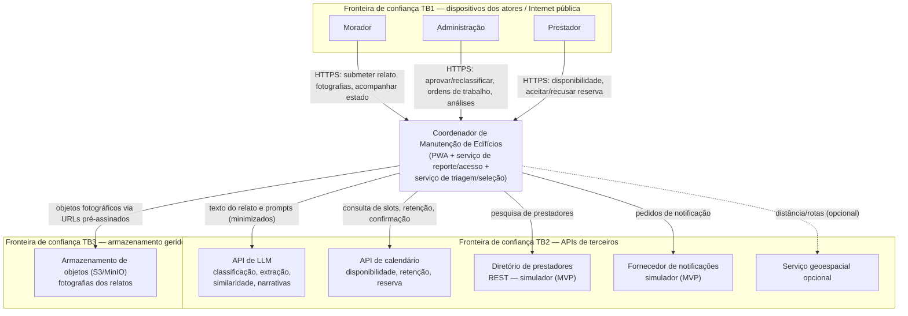
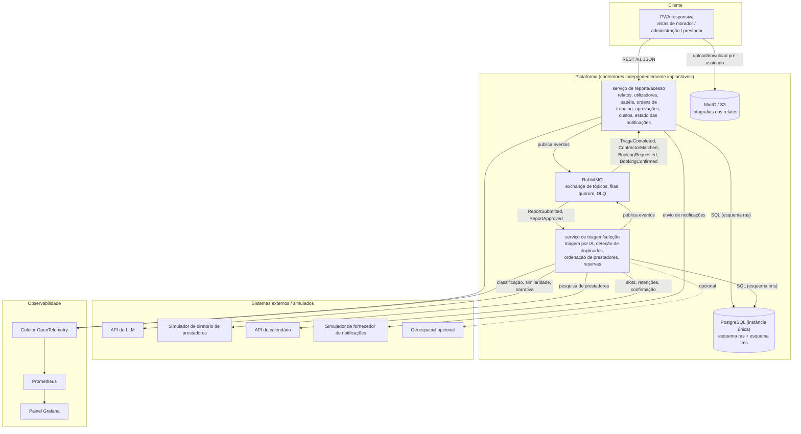

# Arquitetura de Sistema de Alto Nível — Coordenador de Manutenção de Edifícios (CME)

> **Estado:** Concluído — pronto para entrega · **Autoria:** Arquiteto de Software
> **Última atualização:** 2026-10-08
> **Satisfaz:** Enunciado oficial §6.1–6.8 (aplicação cliente, arquitetura backend, fluxo assíncrono, dados, integração externa, autenticação, observabilidade, resiliência); Sprint A, entregável 7 (Desenho Técnico) e entregável 8 (ADRs)
> **Decisões registadas:** ADR-001 PWA vs. nativo · ADR-002 dois serviços vs. monolito modular · ADR-003 PostgreSQL único · ADR-004 API de LLM vs. modelo próprio · ADR-005 autenticação simulada no MVP (na documentação original do projeto)

---

## 1. Visão de contexto (C4 nível 1)

A fronteira **TB4 (interna)** separa os dois serviços backend, o *broker* e os esquemas da base de dados; o acesso serviço-a-serviço é autenticado e de privilégio mínimo (ADR-002). A identidade em TB1 é enfraquecida no MVP pela autenticação simulada (ADR-005), explicitamente permitida pelo enunciado (nota de rodapé do §6.6).

## 2. Atores

| Ator | Objetivo (ver `02-personas.md`) | Onde toca |
|---|---|---|
| Morador (Maria) | Reportar uma vez e saber quem vem e quando | Submissão de relato, fotografia, estado e notificações |
| Administração (João) | Manter o edifício a funcionar e justificar custos | Revisão/aprovação da triagem, ordens de trabalho, custos, análises |
| Prestador (Carlos) | Contexto antes de chegar, trabalho local estável | Disponibilidade, detalhe da reserva, atualizações de estado |

## 3. Vista de contentores (C4 nível 2)

### 3.1 Contentores

| Contentor | Responsabilidade | Tecnologia (proposta) | Dados que possui | Comunicação |
|---|---|---|---|---|
| Cliente PWA | Jornadas dos atores, acompanhamento de estado, captura de fotografia | TypeScript, React, Vite, Workbox | Nenhum dado autoritativo; cache de leitura *offline* | REST para o serviço de reporte/acesso; REST pré-assinado para o MinIO |
| Serviço de reporte/acesso | Ciclo de vida de relatos/ordens de trabalho, aprovações, papéis, auditoria, custos, estado das notificações | OpenAPI-first; Java/Spring ou Node/TypeScript (Sprint B) | Edifícios, frações, utilizadores, relatos, metadados de fotografias, ordens de trabalho, custos, notificações, auditoria | REST com o cliente; eventos com o serviço de triagem/seleção |
| Serviço de triagem/seleção | Sugestões de triagem, deteção de duplicados, ordenação, reservas | OpenAPI-first; worker + fachada REST | Sugestões de triagem, cache de prestadores, disponibilidade, reservas | Eventos com o serviço de reporte/acesso; REST para LLM, diretório e calendário |
| RabbitMQ | Transporte durável, retentativas, DLQ | RabbitMQ 3.x, exchange de tópicos, filas quorum | Mensagens, conteúdo da DLQ | AMQP |
| PostgreSQL | Armazenamento persistente; uma instância, dois esquemas | PostgreSQL 16, migrações Flyway | Todos os dados da plataforma, por esquema proprietário | SQL em rede privada |
| MinIO (API S3) | Armazenamento de objetos fotográficos | MinIO, compatível com S3 | Bytes das fotografias | API S3, URLs pré-assinados |
| Pilha de observabilidade | *Logs*, *traces*, métricas, painel | Coletor OTel, Prometheus, Grafana | Telemetria (retenção curta) | OTLP, *scrape* |
| Simuladores | Diretório, calendário, notificações | Serviço REST ou WireMock com injeção de falhas | Dados externos sintéticos | REST |

### 3.2 Porque estas fronteiras

- **Coesão:** o serviço de reporte/acesso é dono do registo transacional; o de triagem/seleção é dono do raciocínio probabilístico sobre «o que deve acontecer a seguir». Mudam por razões e ritmos diferentes (fluxo/papéis vs. qualidade da IA).
- **Independência de implantação:** alterações de *prompt*, ordenação ou fornecedores no serviço de triagem implantam-se sem tocar no ciclo de vida dos relatos; as chaves e quotas do LLM vivem apenas nesse serviço.
- **Isolamento de falhas:** uma indisponibilidade do LLM, diretório ou calendário degrada apenas a triagem/seleção; a receção de relatos e o acompanhamento de estado continuam. A fila absorve picos e paragens.
- **Propriedade de dados:** uma instância de base de dados, dois esquemas, sem consultas cruzadas; integração apenas por REST ou eventos, imposta por permissões de esquema e testes de contrato no CI.
- **Adequação à equipa:** alinha-se com as duas pistas de desenvolvimento definidas nos papéis da equipa.

### 3.3 Compromissos assumidos (trade-offs)

- Mais peças móveis do que um monolito; o desenvolvimento local exige Compose e um *broker*.
- A consistência eventual obriga a estados pendentes na UI (a triar, a emparelhar) em vez de estados síncronos.
- Uma instância única de PostgreSQL continua a ser um ponto único de falha; a rever antes de produção (ADR-003).
- O envio de notificações começa como módulo dentro do serviço de reporte/acesso; extraível mais tarde sem alterar contratos.

## 4. Fluxo assíncrono (requisito do enunciado §6.3)

O fluxo central: `ReportSubmitted` (reporte/acesso → triagem/seleção) → sugestão de triagem → `TriageCompleted` → revisão humana → `ReportApproved` → ordenação e retenção de slot → `ContractorMatched`/`BookingRequested`/`BookingConfirmed` → notificações. Garantias de fiabilidade:

- **Deduplicação por identificador de evento:** cada consumidor mantém uma tabela de *inbox* com restrição única; repetições são ignoradas.
- **Outbox transacional:** alteração de domínio e registo de outbox confirmam na mesma transação; um *relay* publica e marca como enviado, evitando escritas duplas.
- **Retentativas:** recuo exponencial com *jitter* (1 s, 5 s, 30 s, 2 m, 10 m), máx. 5 tentativas, depois DLQ.
- **Fila de mensagens mortas com replay seguro:** inspeção dos cabeçalhos de morte, correção da causa e republicação do envelope preservando o identificador (a deduplicação e a idempotência tornam o replay seguro).
- **Idempotência:** alterações de estado com versão otimista; reservas chaveadas por `idempotencyKey`, com uma reserva ativa por ordem de trabalho.
- **Consistência eventual:** janelas alvo declaradas (submissão→Triado p95 ≤ 30 s; aprovação→Emparelhamento ≤ 5 s; confirmação→notificação ≤ 2 min) e sinalização de relatos presos.

## 5. Integrações externas e tratamento de falhas

| Dependência | Finalidade | Dados que saem | Dados que entram | Forma no MVP | Se indisponível |
|---|---|---|---|---|---|
| API de LLM | Triagem, extração, similaridade, narrativas | Texto do relato, sem identificadores diretos | JSON estruturado, confiança, metadados do modelo | API real | Classificador de regras + fila de triagem manual |
| Diretório de prestadores | Pesquisa e entradas da ordenação | Categoria de serviço, localização ao nível do código postal | Perfil, categorias, tarifas, avaliação | Simulador | Última cópia em cache, marcada como possivelmente desatualizada; emparelhamento manual |
| API de calendário | Disponibilidade, retenção de slots, confirmação | ID do prestador, slot, referência da ordem de trabalho | Estado do slot, IDs de retenção/confirmação | Simulador | Retenção local do slot, sincronização posterior |
| Fornecedor de notificações | Entrega de email/SMS/push | Contacto do destinatário, modelo, parâmetros | Estado de entrega | Simulador | Fila de notificações persistida + retentativas; o estado na aplicação mantém-se autoritativo |
| Armazenamento de objetos | Persistência e leitura de fotografias | Bytes e metadados da fotografia | URL pré-assinado / chave do objeto | MinIO (API S3) | Upload rejeitado com orientação de retentativa; o relato textual continua aceite |
| Geoespacial (opcional) | Sinal de distância/rota para a ordenação | Código postal / coordenadas | Estimativa de distância | Não planeado para a Sprint B | Ordenação recorre aos atributos do diretório |

## 6. Implantação e operação

- **Contentores:** aplicação entregue com Docker Compose em desenvolvimento e *staging*; imagens construídas pelo pipeline.
- **Configuração e segredos:** configuração por ambiente; segredos fora do repositório e das imagens, injetados na implantação.
- **CI/CD (GitHub Actions):** compilação → testes → análise estática → verificação de dependências e segredos → construção de imagem → implantação em *staging*; feedback rápido e visível.
- **Reversão:** implantação por etiqueta de imagem; reversão para a etiqueta anterior documentada; migrações de esquema para a frente e reversíveis quando viável.
- **Observabilidade:** *logs* estruturados, *health checks* (`/health/live`, `/health/ready`), métricas (relatos submetidos, latência da triagem p95, taxa de aceitação da IA, profundidade da fila), identificadores de correlação/*trace*, relatório de erros e painel operacional (Grafana).
- **Resiliência demonstrada:** pelo menos um cenário degradado implementado e demonstrado — IA indisponível (classificador de regras + fila manual) e/ou calendário indisponível (retenção provisória local + sincronização), com comunicação clara das limitações ao utilizador.

## 7. Limitações

- O desenho é um rascunho de Sprint A: a implementação executável (incluindo o *walking skeleton* com build, teste e implantação em contentores) arranca na Sprint B, conforme o plano de sprints.
- Os mecanismos de retentativa/DLQ só ficam provados com os testes de resiliência da Sprint B/C; o modelo é *at-least-once* com consumidores idempotentes, não *exactly-once*.
- Assume-se que os edifícios-piloto aceitam enviar texto de relatos para uma API de LLM de terceiros sob acordo de tratamento de dados; a avaliação de privacidade deve confirmar antes do arranque do piloto.
- Diretório, calendário e notificações são simuladores no MVP; a troca por fornecedores reais altera adaptadores e configuração, não o modelo de domínio.

## 8. Percurso de engenharia (Análise → Desenho → Revisão)

| Fase | Atividade / evidência | Estado |
|---|---|---|
| Análise | Leitura do enunciado §6.1–6.8 e do briefing mestre; extração de atores, externos e fluxos de dados; identificação das fronteiras de confiança | Concluída |
| Desenho | C4 L1 e L2, tabelas de atores/contentores/dependências, fluxo assíncrono, implantação, observabilidade e ADRs | Concluída |
| Revisão | Revisão interna concluída; validação com o investidor integrada na primeira entrega; verificação de esquema/contratos no CI durante a Sprint B | Concluída |

## 9. Questões abertas para o investidor/cliente

1. A revisão da Sprint B deve mostrar os dois serviços reimplantados de forma independente?
2. Uma instância de PostgreSQL com dois esquemas é evidência suficiente de propriedade de dados, ou espera-se uma base de dados por serviço?
3. O envio de notificações deve tornar-se um contentor separado na Sprint B ou permanecer um módulo interno?
4. Que mecanismo de atualização em tempo real deve entrar em âmbito (polling, SSE, WebSocket) para o acompanhamento de estado?
5. Que canais de notificação são aceitáveis para o piloto (apenas email, ou SMS/WhatsApp conforme preferência do morador)?
